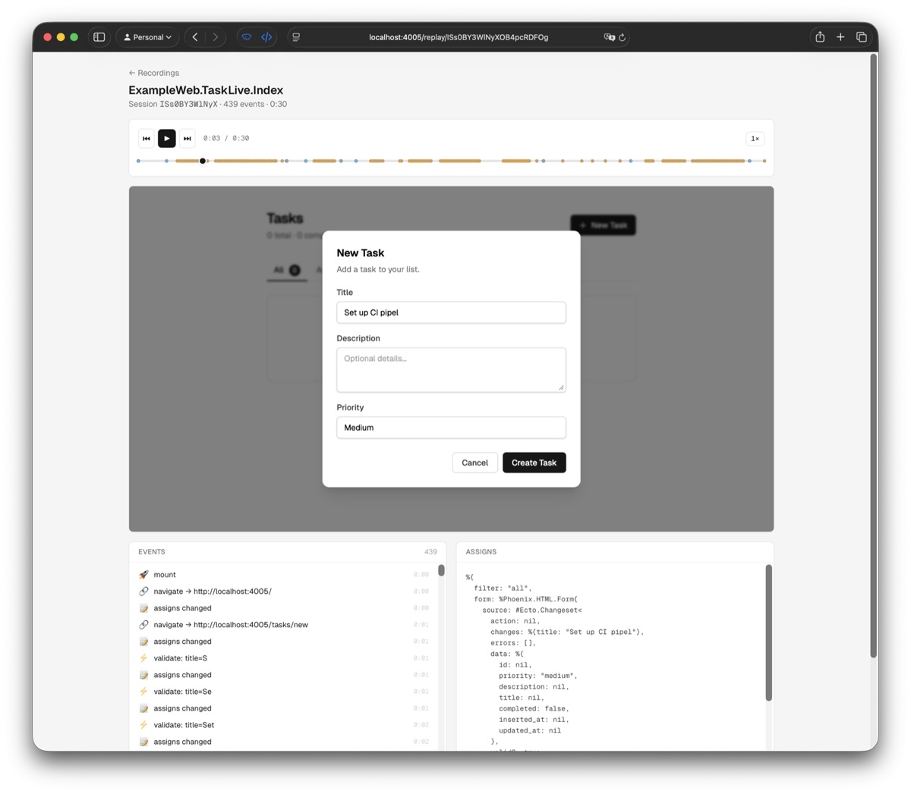

# PhoenixReplay

Session recording and replay for Phoenix LiveView — no client-side JS, no rrweb, just BEAM.



LiveView templates are pure functions: same assigns → same HTML. PhoenixReplay captures assigns at each state transition, so replay is just injecting them back. The database is never consulted.

## Installation

```elixir
def deps do
  [
    {:phoenix_replay, "~> 0.1.0"}
  ]
end
```

## Usage

Add the recorder hook to your `live_session`:

```elixir
live_session :default, on_mount: [PhoenixReplay.Recorder] do
  live "/dashboard", DashboardLive
  live "/posts", PostLive.Index
end
```

That's it. Every connected LiveView session is now recorded — mount params, events, navigation, and assigns deltas.

### Manual attachment

If you don't want to record all views in a live_session:

```elixir
def mount(params, session, socket) do
  {:ok, PhoenixReplay.Recorder.attach(socket, params, session)}
end
```

### Dashboard

Mount the built-in replay viewer in your router:

```elixir
defmodule MyAppWeb.Router do
  use Phoenix.Router
  import PhoenixReplay.Router

  scope "/" do
    pipe_through :browser
    phoenix_replay "/replay"
  end
end
```

Visit `/replay` to browse recordings and replay sessions with a scrubber, play/pause, and speed controls.

### Accessing recordings programmatically

```elixir
PhoenixReplay.Store.list_recordings()
PhoenixReplay.Store.get_recording(id)
PhoenixReplay.Store.get_active(id)
```

## What gets recorded

For each session:

| Event | Data |
|---|---|
| Mount | View module, URL, params, session, initial assigns |
| Handle event | Event name, params |
| Handle params | URL, params |
| Handle info | (type marker only) |
| After render | Changed assigns (delta, or full snapshot when batched) |

Each event includes a millisecond offset from session start.

Sessions with no user interaction (no events and no navigation beyond the initial page) are discarded automatically.

A 30-second session with active form typing is ~400 events ≈ 8KB on disk
(ETF + gzip). Recordings are automatically compressed.
Compare that to rrweb which generates 5–50MB per session.

## Configuration

```elixir
config :phoenix_replay,
  max_events: 10_000,        # cap per session (default: 10,000)
  sanitizer: MyApp.Sanitizer # custom assigns filter (default: PhoenixReplay.Sanitizer)
```

### Storage backends

Active recordings live in ETS. Events are appended via pure ETS writes — no GenServer calls on the hot path. When a LiveView process exits, the recording is finalized and persisted via the configured storage backend.

#### File (default)

Writes one file per recording to disk. No dependencies required.

```elixir
config :phoenix_replay,
  storage: PhoenixReplay.Storage.File,
  storage_opts: [
    path: "priv/replay_recordings",
    format: :etf  # or :json
  ]
```

#### Ecto

Stores recordings in a database table. Requires `ecto_sql` in the host app.

```elixir
config :phoenix_replay,
  storage: PhoenixReplay.Storage.Ecto,
  storage_opts: [repo: MyApp.Repo, format: :etf]
```

Create the migration:

```elixir
defmodule MyApp.Repo.Migrations.CreatePhoenixReplayRecordings do
  use Ecto.Migration

  def change do
    create table(:phoenix_replay_recordings, primary_key: false) do
      add :id, :string, primary_key: true
      add :view, :string, null: false
      add :connected_at, :bigint, null: false
      add :event_count, :integer, null: false, default: 0
      add :data, :binary, null: false

      timestamps(type: :utc_datetime)
    end
  end
end
```

Both backends support `:etf` (Erlang Term Format, default — fast, compact, preserves all Elixir types) and `:json` (portable, human-readable, but lossy for atoms, tuples, and structs).

### Custom sanitizer

The default sanitizer strips internal LiveView keys (`__changed__`, `flash`,
`uploads`, `streams`, `_replay_id`, `_replay_t0`) and sensitive fields
(`csrf_token`, `current_password`, `password`, `password_confirmation`,
`token`, `secret`). It also compacts `Phoenix.HTML.Form`, `Ecto.Changeset`,
and Ecto schema structs to remove runtime-only data.

To customize, implement `sanitize_assigns/1` and `sanitize_delta/2`:

```elixir
defmodule MyApp.ReplaySanitizer do
  @drop [:__changed__, :flash, :uploads, :streams,
         :_replay_id, :_replay_t0, :csrf_token, :password,
         :current_password, :password_confirmation, :token, :secret,
         :my_custom_secret]

  def sanitize_assigns(assigns) do
    Map.drop(assigns, @drop)
  end

  def sanitize_delta(changed, assigns) do
    changed
    |> Map.keys()
    |> Enum.reject(&(&1 in @drop))
    |> Map.new(fn key -> {key, Map.get(assigns, key)} end)
  end
end
```

## How it works

1. An `on_mount` hook attaches lifecycle hooks to each connected LiveView
2. Session start sends a single async cast to the Store GenServer (to set up a process monitor)
3. All subsequent events are written directly to ETS (`ordered_set` with `write_concurrency`) — no messages, no GenServer calls on the hot path
4. When the LiveView process exits, the Store auto-finalizes and persists via the configured storage backend

## Roadmap

- [ ] Real-time session observation via PubSub
- [ ] LiveComponent state tracking
- [ ] Configurable sampling (record N% of sessions)
- [ ] Session search and filtering

## License

MIT
